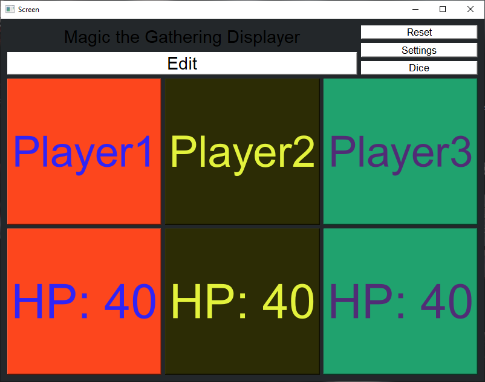
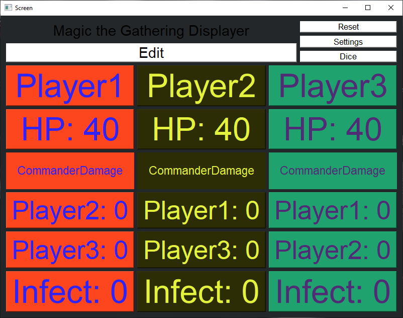
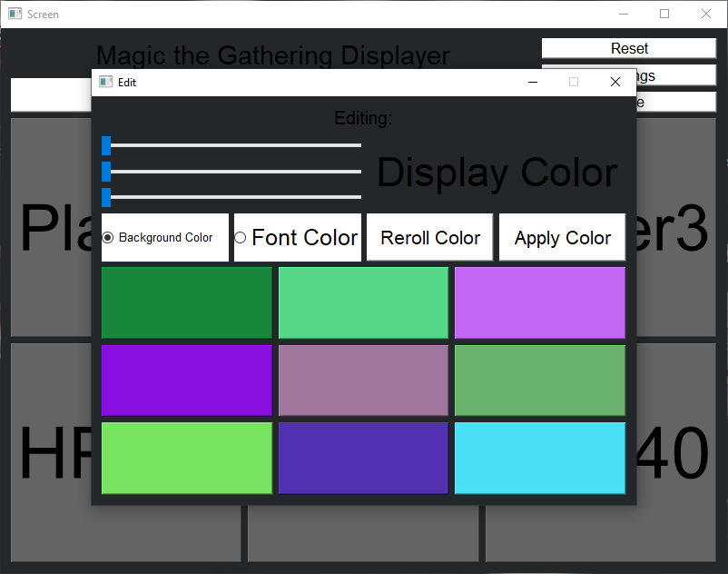

# MagicUi
MagicUi offers an interactive interface for the popular cardgame *Magic: The Gathering*.

## Interface

Main menu            |  All counters
:-------------------------:|:-------------------------:
  |  

Edit Color          |  Settings
:-------------------------:|:-------------------------:
  |  

| Dice        |
|:-------------------------:|
| |

## User guide
- Download the directory `release/windows`
- Navigate to `release/windows` and execute `MagicUi.exe`

## Supported operating system
- [x] Windows 10
- [ ] Ubuntu (on demand)
